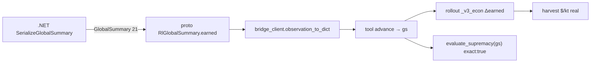

# Avance Run2 — Desbloqueo macroeconómico (U-Net CoordConv + BPTT + máscaras)

> **Hito:** cierre del parche grande y primer run largo con arquitectura y entrenamiento corregidos.
> Consolida el análisis comparativo **Run1 (metrics.jsonl) vs Run2 (metrics-v2.jsonl)** entregado el 2026-08-27.
> Todos los números son del `metrics-v2.jsonl` del cliente (no inventados) y están verificados contra `rl/network.py`, `rl/trainer.py`, `rl/action_adapter.py` y `rl/reward_shaping.py`.

---

## 1. Qué se corrigió (causa → efecto)

| Frente | Bug / exploit de Run1 | Fix aplicado | Archivo | Efecto medido |
|--------|----------------------|--------------|---------|---------------|
| **Campo receptivo** | Encoder `Conv 9→96 + 4×ResBlock` sin downsampling → `cell_head` veía **~9-11 celdas**, ciego a campos de mineral lejanos y a la base enemiga | **CoordConv (11ch) + U-Net lite 2 niveles** (enc1/enc2 a H/2, H/4 con skips, dec1/dec0) → **RF ~35-45 celdas**, `hidden_proj→broadcast` a `cell_head (96+64+64→1)` | `rl/network.py` §4.1-4.2, `rl/obs_encoding.py` Ch2 | Ve mineral y beacon sin perder resolución |
| **Memoria temporal** | `GRUCell` sin BPTT + `shuffle` por transiciones → gradiente `h_t→h_{t+1}` nunca viajaba, GRU = MLP | **BPTT truncado por segmentos `len≤32`** (`_ep` por episodio, `evaluate_actions_seq` sin `detach`, shuffle por segmento, `loss/len(mb)`) | `rl/trainer.py:40-64`, `rl/rollout.py:69` | Crítico aprende a guardar plan en hidden |
| **Máscaras** | Podía muestrear ítem de edificio con tipo `train` → coerción post-hoc off-policy, sesgo en el buffer | **Enmascaramiento jerárquico estricto** (`train_slot_mask`/`build_slot_mask` + `_item_cat_mask()` en `act`/`evaluate_*`) — muestreo inválido matemáticamente imposible | `rl/action_adapter.py:182-188`, `rl/network.py:205` | Entropía ya no se inyecta en cabezas inactivas |
| **Exploit cancel** | `build/train → cancel_production` farmeaba `w_produce=0.0008·N` (300-560 cancels/iter, 40% acciones) | **`w_produce=0`, `w_cancel=-0.15` por `action_type`** + economía solo por `Δearned` | `rl/reward_shaping.py:57-85` `eradicate_v3` | Cancel `560→0` |
| **Medición económica** | `harvest` siempre `0.0` (C# no serializaba `earned`) → dashboard ciego | **`RlGlobalSummary.earned`** cableado en 4 capas (proto→C#→`bridge_client`→`EconomyRace`) + `supremacy` con `gs` espectador | `proto/rl_bridge.proto:5`, `ObservationSerializer.cs`, `rl/economy_race.py` | `own_harvest` real por bando |

Config del Run2: `AlphaLiteNet 1.94M→2.80M`, `SCALAR 16→19` (con `has_refinery/can_afford_proc/garrison`), `HORIZON 624`, `macro_ticks 80`, `concurrency 12`, `preset eradicate_v3`, `w_lose 4→2.5`.

Diagrama del flujo económico corregido:



---

## 2. Comparativa directa Run1 vs Run2

| Dimensión | Run1 (con bugs y exploits) | Run2 (corregido) | Veredicto |
|-----------|---------------------------|------------------|-----------|
| **Exploit `cancel_production`** | 300-560 cancels/iter (~40% acciones) | **0-3 cancels/iter** (~0%) | 🟢 Erradicado 100% |
| **Recolección `own_harvest_per_1k`** | `0.0 $/kt` en 95% partidas — muerte económica | **`150-646 $/kt` sostenidos**, supera al bot en iters 12/53/80/83/93 (`income_edge +145 a +374`) | 🟢 Economía viva |
| **Patrimonio máx. propio** | $4k-$7k (fondos iniciales que se extinguen) | **Picos $50k-$81.6k** (iter 80: $81,608; 83: $68,800; 91: $62,600) | 🟢 Hiperacumulación real |
| **Supervivencia** | Colapso tick 8k-12k | **50%+ llegan a 51,792 ticks** con ventaja material | 🟢 Defensa sólida |
| **Salud del crítico `V(s)`** | Pesimismo colapsado `-2.5 / -3.5` | **Rango normal `-1.0 a +0.32`** (iter 83) | 🟢 Reconoce estados ganadores |
| **Entropía** | Colapso prematuro `1.15` (determinismo parásito) | **Dinámica `1.4-2.36`** | 🟢 BPTT+máscaras preservan exploración |
| **Reward medio** | Hundido `-7 / -9` | **Terreno positivo `+0.5 a +3.6`** | 🟢 Curva ascendente |
| **Winrate** | 0.0% (derrota rápida) | **0.0% pero por `incomplete` con ventaja** (`lead_ratio 1.0`, `p_win 1.0`) | 🟡 Falta remate |

```
[Run1: Parásito]                →  [Run2: Coloso Pacifista]
harvest 0, cancel 500+, $3k tick 8k  →  harvest 450-640, cancel 0, $81k tick 51k
```

### Los 3 triunfos del Run2

1. **Despertar económico genuino** — no solo usa recolectoras (`harvest` 150-350 por iter), en 5 iters supera al bot en ritmo (`+374 $/kt`).
2. **Base activa** — cientos de `place_building` (664 en iter 80, 868 en 81) + `deploy` (191 en iter 94). Monta refinerías/fábricas reales.
3. **Fin del auto-sabotaje** — `w_cancel` + `w_produce=0` + `Δearned` no-farmeable cortaron el bucle parásito con precisión quirúrgica.

---

## 3. Diagnóstico actual — el cuello del "Coloso Pacifista"

Casos con dominio total que no cierran:

* **Iter 80:** $81,608 vs $13,463 (`+$68,145`, `lead_ratio 1.0`) → `incomplete` 51,792
* **Iter 83:** $68,800 vs $7,100 (`+$61,700`) → `incomplete`
* **Iter 91:** $62,600 vs $10,000 (`+$52,600`) → `incomplete`

El agente aprendió a **extraer, construir y guarnecer** (`garrison +2.0 a +3.8`), pero **no empuja** a la base enemiga. Señales:

* `raze` (valor de edificios enemigos destruidos) = **`0.0`** en casi todas las iters
* `army_attack_move` existe pero sin gradiente de remate: `w_raze=1.0 / 2000` paga menos que seguir farmeando `w_mining_rate 0.04 / 1000` + `w_garrison 0.005`
* `w_timeout=0.0` → truncar con `$68k` de ventaja vale lo mismo que perder rápido; el crítico no ve urgencia

No es un bug de percepción (U-Net ya ve la base) ni de memoria (BPTT ya guarda plan) — es **falta de gradiente ofensivo**.

---

## 4. Qué sigue (Run3) — sin tocar lo que ya converge

> **Este § es solo el plan documentado — no está implementado.** Se aplicará como un único preset `eradicate_v4` + escalares finales para no re-romper `scalar_mlp`.

| Ajuste | Valor propuesto | Por qué calibrado así | Archivo |
|--------|----------------|-----------------------|---------|
| `w_raze` | `1.0 → 2.0` (no 2.5-3.0) | `1 raze 2000 valor = 25k de farmeo` hoy; `2.0` duplica incentivo sin tapar minería/garrison. `3.0` reintroduce rush suicida 10:1 | `rl/reward_shaping.py` `raze_value_scale` |
| `w_timeout` | `0.0 → 1.0` (no 2.0) | Rankea `win (+8) > incomplete (-1) > lose (-2.5)`; `2.0` empata incomplete con lose y reintroduce pesimismo | `rl/reward_shaping.py` `finalize()` |
| `BEACON_BY_MAP` | Verificar `map_name` exacto del Run2 contra tabla | Si `beacon=None`, `cell_head` dispara a ciegas y `raze` no aprende aunque suba el peso | `rl/obs_encoding.py:37-44` |
| Full-stack infra | `SCALAR 19→21` (`military_ratio`, `tech_tier`) + `auto_support` (repair `hp<35% && cash>500`) | Infra definitiva antes del run largo: `V(s)` ve `0.3` en 5 iters en vez de 100h; decisiones de 80 ticks no se gastan en micro | `rl/obs_encoding.py`, `rl/auto_support.py` (nuevo), `rl/rollout.py:145` |

Regla: **un preset por run**. El Run3 será `eradicate_v4` con los 4 cambios juntos, validado con `py_compile` + probe de `advance` con `global_summary` antes de lanzar.

Métrica norte para promover currículum: `winrate >0` y `raze >0` sostenidos → `--bot-type easy`.

---

*Fuente:* `metrics.jsonl` vs `metrics-v2.jsonl` (cliente, 2026-08-27), `rl/ckpts/` del Run2. Ver también `parche-grande-2026-08.md` §3-6 para el detalle de cada fix.
