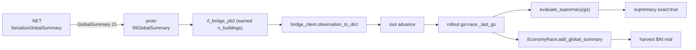
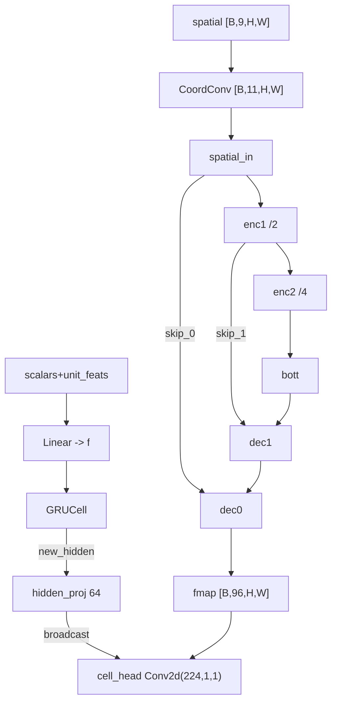

# Parche Grande — Reescritura de arquitectura, entrenamiento y reward (2026-08)

> Documento técnico-fiel al estado del código al **2026-08-26**. Todos los
> números (pesos de reward, tamaños de red, campos del proto, umbrales) están
> tomados tal cual del árbol de trabajo. Algunos premios guardan contexto de
> porqué se eligió cada valor, no solo el valor.

Este documento consolida el **parche grande** aplicado sobre el pipeline
OpenRA-RL: el fix de terminación de partidas, la medición económica completa
(`earned`/`harvest`), la reescritura del encoder espacial, el entrenamiento de
memoria temporal (BPTT) y el rediseño del shaping de reward. Convive con los
documentos previos:

- `docs/fix-endgame-multisesion.md` — el bug de `MissionObjectives`.
- `docs/era-economica.md` — la carrera económica.
- `docs/auditoria-pipeline-2026-08-24.md` — la auditoría de 7 archivos.

---

## 1. Resumen ejecutivo

El último run anterior al parche mostraba un agente que **recolectaba 0 $/kt**
contra el bot (`550–880 $/kt`), con un bucle parásito de
`build/train -> cancel_production` (hasta 35% de las acciones) farmeando un
reward de "producción simulada", y una supremacía falsa (`p_win 0.88`) por usar
niebla de guerra. El parche ataca ese cuadro en 5 frentes:

| Frente | Cambio | Archivos |
|---|---|---|
| Terminación | `MissionObjectives` con `EndGame` directo (sin `RunAfterDelay`) | `OpenRA/.../MissionObjectives.cs` |
| Medición económica | `RlGlobalSummary` con `earned` (recolección real) en 4 capas | proto, C#, `bridge_client.py`, `openra_environment.py` |
| Arquitectura | CoordConv + U-Net lite + broadcast del GRU a `cell_head` → RF ~40 celdas | `rl/network.py` |
| Entrenamiento | BPTT truncado por segmentos + entropía por cabeza activa + enmascaramiento jerárquico | `rl/trainer.py`, `rl/network.py`, `rl/action_adapter.py`, `rl/rollout.py` |
| Reward | Preset `eradicate_v3` (economía real, anti-cancel, combate 3:1) | `rl/reward_shaping.py` |

---

## 2. Fix de terminación de partidas

### 2.1 `MissionObjectives.CheckIfGameIsOver` (EndGame directo)

**Bug:** el código original esperaba con `RunAfterDelay` antes de llamar a
`EndGame`, lo que en escenario multi-sesión (resets reiterados) congelaba la
partida: nunca se declaraba `WinState.Lost`/`WinState.Won` y `winrate` quedaba
en 0.

**Fix:** `CheckIfGameIsOver` ahora llama a `EndGame` directamente cuando el
objetivo está fallado/cumplido (`missionFailed` o `missionAccomplished`), sin
el retraso del dispatcher. Verificado en la DLL del contenedor (`grep
MultiSessionMode`).

```csharp
// OpenRA/OpenRA.Mods.Common/Traits/Player/MissionObjectives.cs
if (missionAccomplished || missionFailed)
    EndGame(world, player);
```

**Vía de derrota cubierta:** el `lose` se dispara cuando el bot destruye el
objetivo/base (`WinState.Lost`). La orden `Surrender` por vía directa sigue sin
gatillar juego-terminado en `FastAdvance` de 1 tick (edge conocido, despriorizado).

---

## 3. Medición económica completa (global_summary → earned)

El dashboard pintaba `harvest = 0` para **ambos** bandos, no porque nadie
minara, sino porque la recolección **no viajaba**: `economy_race` calcula
`harvest` desde `earned`, y el C# no serializaba `earned`. Se cablearon **las 4
capas**:

### 3.1 Proto (`proto/rl_bridge.proto` y copia en `OpenRA/.../Protos/`)

```
message RlGlobalSummary {
    message Side {
        int32 cash = 1;
        int32 unit_value = 2;
        int32 building_value = 3;
        int32 n_buildings = 4;   // conteo de edificios vivos
        int32 earned = 5;        // mineral extraído acumulado (PlayerResources.Earned)
    }
    Side own = 1;
    Side enemy = 2;
}
// GlobalSummary = 21 en Observation
```

El campo `earned` se añadió en último lugar para **no re-numerar campos
publicados** (compatibilidad de stubs entre capas).

### 3.2 Serialización C# (`ObservationSerializer.cs`)

`Serialize()` ahora incluye `GlobalSummary = SerializeGlobalSummary()`, que
rellena para **cada bando**: `Cash`, `Earned` (=`PlayerResources.Earned`),
`UnitValue` (suma de `ValuedInfo.Cost` de unidades), `BuildingValue` y
`NBuildings` (conteo de `BuildingInfo`). Para el bando rival usa la rama
"espectador" (sin niebla) cuando el observador no es aliado.

### 3.3 Traducción Python (`bridge_client.observation_to_dict`)

`observation_to_dict` serializa ahora el `global_summary` (own/enemy con
`cash/unit_value/building_value/n_buildings/earned`) en cada observación; el
tool `advance` lo expone en su retorno. El resultado alimenta
`EconomyRace.add_global_summary`, y de ahí `own_harvest_per_1k` y
`enemy_harvest_per_1k`.

### 3.4 Stubs regenerados (`openra_env/generated`)

`grpc_tools.protoc` regenera `rl_bridge_pb2.py`/`rl_bridge_pb2_grpc.py`. Cada
regeneración **pisa** el import del `pb2_grpc` a `import rl_bridge_pb2`; hay
que re-fijarlo a `from openra_env.generated import rl_bridge_pb2 as rl__bridge__pb2`
(caso ya documentado como guard de rebuild).

### 3.5 Supremacía honesta (niebla)

`evaluate_supremacy(obs, enemy_known=True, gs=None)` acepta ahora un
`global_summary` explícito. `rl/rollout.py` le pasa `gs=race._last_gs` (el
último espectador del `advance`), de modo que el `enemy` deja de subestimarse a
los 600–1000 $ de la niebla. `train.py` guarda `sup_exact` en cada fila del
`metrics.jsonl` para auditar si la supremacía usó espectador.



---

## 4. Arquitectura del agente (`rl/network.py`)

### 4.1 Campo receptivo espacial (CoordConv + U-Net lite)

Antes el encoder era `Conv2d(9→96,3) + 4×ResBlock` sin downsampling: el `fmap`
quedaba a resolución completa y `cell_head` veía **~9–11 celdas**. El parche:

```python
ch = 96
self.spatial_in = nn.Sequential(nn.Conv2d(9 + 2, ch, 3, padding=1), nn.ReLU())  # CoordConv
self.enc1 = nn.Sequential(ResBlock(ch), nn.Conv2d(ch, ch, 3, stride=2, padding=1), nn.ReLU(), ResBlock(ch))
self.enc2 = nn.Sequential(nn.Conv2d(ch, ch, 3, stride=2, padding=1), nn.ReLU(), ResBlock(ch))
self.bott = ResBlock(ch)
self.dec1 = nn.Sequential(nn.Conv2d(2 * ch, ch, 3, padding=1), nn.ReLU(), ResBlock(ch))
self.dec0 = nn.Sequential(nn.Conv2d(2 * ch, ch, 3, padding=1), nn.ReLU(), ResBlock(ch))
```

- **CoordConv:** `_coord_conv` añade los canales 9 y 10 con `x,y ∈ [-1,1]`
  normalizados por w/h a la entrada. Primera capa pasa a `Conv2d(11,...)`.
- **U-Net lite (2 niveles):** `enc1`/`enc2` bajan a H/2 y H/4 con skips;
  `dec1`/`dec0` suben + `concat(skip)` + conv. RF efectivo **~35–45 celdas**.
- El `fmap` final mantiene resolución completa `[B,96,H,W]` (ningún down del
  output), así `cell_head`/`spatial_vec` y las cabezas no cambian de
  geometría.

### 4.2 Broadcast del estado global del GRU a `cell_head`

```python
self.hidden_proj = nn.Linear(HIDDEN_DIM, 64)
self.cell_head  = nn.Conv2d(96 + 64 + 64, 1, 1)  # fmap + emb tipo + hidden
```

`_logits_cell(fmap, chosen_type, cell_mask, hidden)` proyecta `new_hidden` →
`hidden_proj` → broadcast `[B,64,1,1]` y lo concatena a `fmap + emb tipo`.
La decisión de celda ahora "ve" el estado global (plan, memoria), no solo el
parche local. **Parámetros: 1.94M → 2.80M.**



### 4.3 Enmascaramiento jerárquico estricto (anti-engagement off-policy)

**Bug:** la red podía muestrear un ítem de edificio con tipo `train`; la fase
`index_to_command_effective` lo "reparaba" mutándolo, inyectando sesgo
off-policy (el buffer contaba un evento forzado como acción de la política).

**Fix (autorregresivo):** las máscaras de ítems ahora dependen del tipo.

```python
# action_adapter.build_batch
train_slot_mask  # True solo en slots de train_items
build_slot_mask  # True solo en slots de build_items
```

```python
# network._item_cat_mask(batch, t_idx)
#  tipo train -> item_mask & train_slot_mask
#  tipo build -> item_mask & build_slot_mask
#  otros      -> base (sin ítems; use_i es False)
```

`_item_cat_mask` se aplica en `act`, `evaluate_actions` y
`evaluate_actions_seq` (`safe_item_mask = _item_cat_mask(...).clone()`). Con la
máscara estricta es **matemáticamente imposible** muestrear un ítem inválido, y
ya no hay coerción post-hoc. `rollout._batch_of` empaqueta ambas máscaras (si
una muestra vieja no las trae, `evaluate_actions_seq` hace fallback a
`item_mask`).

### 4.4 Entropía por cabeza activa

Antes `entropy = (h_t + h_u + h_i + h_c) / 2.75` sumaba **siempre** las 4
cabezas. Ahora se enmascara por cabeza activa y el denominador es dinámico:

```python
use_u_f = use_u.float();  use_c_f = use_c.float() * 0.25
use_i_f = (use_i & has_items).float() * 0.5
entropy = ((h_t + torch.where(use_u, h_u, zero)
                + torch.where(use_c, h_c, zero)
                + torch.where(use_i & has_items, h_i, zero))
           / (1.0 + use_u_f + use_c_f + use_i_f))
```

Un `no_op`/`train` ya no inyecta gradiente de exploración en
`cell_head`/`unit_scorer`. (En `evaluate_actions` y `evaluate_actions_seq`.)

---

## 5. Entrenamiento con memoria temporal (`rl/trainer.py`, `rl/rollout.py`)

### 5.1 BPTT truncado por segmentos

**Bug:** `GRUCell` sin BPTT + `np.random.shuffle` de transiciones → el gradiente
nunca viaja `h_t → h_{t+1}` y el `GRU` se entrena como un MLP no-recurrente.

**Fix:** `PPOTrainer.update` reconstruye **segmentos** (≥1 paso, id de episodio
`_ep`, hasta `bptt_len=32` pasos consecutivos del mismo episodio), baraja
**por segmento** (no por transición) y usa `net.evaluate_actions_seq(seg)` que
propaga el hidden **sin `detach`**:

```python
h = seg[0]["h_in"].to(device)          # arranque del segmento (constante)
for s in seg:
    fmap, _, h = self.encode(b["spatial"], b["scalars"], b["unit_feats"],
                             b["unit_valid"], h)   # SIN detach -> BPTT
    lp_t, ent_t, value_t = ...          # log_prob/entropía/valor por step
```

- `backward` por segmento acumulando gradientes (1 grafo a la vez → sin OOM);
  `loss / len(mb)` para no escalar el gradiente con el nº de segmentos del
  mini-batch (`segs_per_batch ≈ round(batch_size / bptt_len)`).
- `rl/train.py::process_results` marca `_ep` en cada muestra para que el
  segmentado no cruce partidas.

### 5.2 Colecta de métricas nuevas

`rollout` emite por episodio `action_hist` (histograma de tipos de acción
efectivos) y `n_buildings` (conteo espectador al cierre); `train.py` los agrega
por iteración (`metrics.jsonl`). `sup_exact` indica si la supremacía usó
espectador.

---

## 6. Reward shaping (`rl/reward_shaping.py`)

Presets: `legacy`, `eradicate`, `eradicate_v2`, `eradicate_v3`. Un **cambio de
régimen por vez** (flag `--shaper-preset`). El componente `harvest`/`mining`,
`defense_loss`, `spread`, `hold_zero`, `produce`, `cancel_penalty` y `win`
salen en `reward_components` del `metrics.jsonl`.

| Componente | Fórmula (por bloque ≈80 ticks) | Preset v3 |
|---|---|---|
| `combat` (asm 3:1) | `+0.15·Δ(kills_cost)/1000 − 0.05·Δ(deaths_cost)/1000` | activo |
| `raze` | `+1.0·Δ(building_value_enemy)/2000` (sin cap) | activo |
| `defense_loss` | `−0.25·Δ(building_value_own)/2000` **−3.0 la 1ª edif. perdida** | activo |
| `hold_zero` | `−0.06/bloque` con 0 edificios propios | activo |
| `spread` | `+0.002·Δ(diff material exacto)/1000` | activo |
| `refinery` | `+1.0` único al tener `proc` | activo |
| `harvester_up` | `+0.25/recolectora` (cap 4) | activo |
| `mining_rate` | `+0.03·Δearned/1000` (cosecha automática real) | activo |
| `harvester_idle` | `−0.01/bloque` con harv pero sin ganancia (**solo `closing`**) | activo |
| `produce` | por **colas activas** (`prod_active`), `w_produce=0.0` en v3 | desactivado |
| `cancel_penalty` | `−0.15` por `cancel_production` (`action_type`) | activo |
| `win` / `lose` | `+8.0` / `−2.5` ($w_lose$ reducido vs 4.0) | activo |
| `timeout` | `w_timeout=0.0` | inactivo |

### 6.1 Correcciones anti-farm del último run

- **`produce` por mera existencia** (`0.0008·N` de edificios) fomentaba
  SimCity; el bucle `build/train -> cancel` lo farmeaba. En v3: **`w_produce=0`**
  y la economía solo viaja por infraestructura real (`refinery`/`harvester_up`)
  + `Δearned` (que no se puede simular). Además, cada `cancel_production` paga
  `−0.15` (el `shaper.step` recibe `action_type`).
- **Asimetría combate 10:1 → 3:1** (`0.5/0.05` → `0.15/0.05`): mantiene "no
  temer salir" sin rentabilizar zerg-rush.
- **`harvester_idle` solo al cerrar** el bloque macro (`closing=True`): el
  micro-step de 2 ticks nunca llega a descargar mineral y antes castigaba cada
  decisión con un harvester vivo.
- **`_v3_econ` desacoplado:** `r_mining`, `r_produce` y `r_cancel` escriben en
  `last_components` por separado (antes `mining += r` contaminaba la métrica).

```mermaid
flowchart TB
    subgraph shine bloque macro (~80 ticks)
        A["obs + gs (espectador)"] --> B["_v2_dense"]
        B --> C["raze + defense_loss + hold_zero + spread"]
        A --> D["_v3_econ (obs, gs, action_type, closing)"]
        D --> E["+ refinery/harvester/mining_rate/-idle(solo closing)"]
        D --> F["+ cancel_penalty (action_type == cancel_production)"]
    end
    G["finalize: win/lose/timeout"] --> R["r_total"]
    C --> R
```

---

## 7. Estabilidad y operación

- **Fuga de memoria `.NET`:** `RLSessionManager.DestroySession` ahora hace
  `GC.Collect(); GC.WaitForPendingFinalizers(); GC.Collect()` tras el dispose → el
  daemon se mantiene en meseta en vez de subir hasta OOM (`bridge failed to start`).
  Límite del contenedor: **6G**.
- **`docker/entrypoint.sh`:** limpia `/tmp/.X99-lock` y socket antes de Xvfb
  (evita el `Server is already active` tras recreaciones abruptas).
- **Guards de rebuild:** tras cada `protoc` re-fixear el import de
  `rl_bridge_pb2_grpc.py`; verificar en binario (`grep Earned`/`MultiSessionMode`
  en la DLL) y con un probe de flujo (`advance` con `global_summary` real).

## 8. Organización del repo de agentes

`rl/` quedó con el **núcleo** en raíz (`train`, `rollout`, `network`, `trainer`,
`reward_shaping`, `action_adapter`, `economy_race`, `supremacy`, `obs_encoding`,
`roles`) y lo auxiliar movido a:
- `rl/tools/` — probes, análisis, generadores (`probe_*`, `analyze`, `make_*`, …).
- `rl/tests/` — tests (`test_*`).

Los scripts de `rl/tools/` que importan `rl.*` se ejecutan como
`python -m rl.tools.<nombre>` desde la raíz del proyecto.

---

## 9. Pendientes / foco de mejora

- **Throughput:** benchmark confirmó que la GPU está al **24%** con 8 workers:
  la inferencia **no** es el cuello (≈20% del wall secuencial se solapa con el
  engine en paralelo); el bottleneck real es el **engine `.NET`** (~72%). Se
  descartó el batched runner; la palanca es más ticks por `advance`/acelerar el
  daemon.
- **Renatra de cierre:** la política usa `attack_move` masivo pero **no
  mina** → sin reposición pierde la guerra de desgaste. El `eradicate_v3`
  apunta a corregirlo en el próximo run.